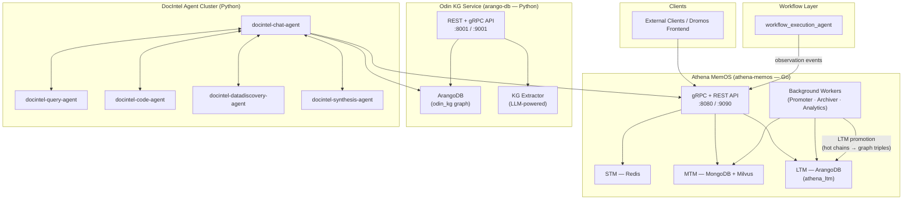

# dromos-core — Ecosystem Overview

> **dromos-core** is the monorepo for the back-end services that power the **Dromos** platform — an AI-augmented workspace for document intelligence, workflow automation, and persistent agent memory.

This document is the entry point for new collaborators. Read it before touching any code. It takes about 10 minutes.

---

## Platform Mission

Dromos gives AI agents **persistent memory and structured knowledge** so they can reason across sessions, services, and teams. Where most AI applications forget everything after a conversation ends, Dromos agents retain — and build on — what they have learned over time.

The three-layer memory architecture at the heart of the platform (Short-Term → Mid-Term → Long-Term) is implemented in **Athena MemOS**. Everything else in dromos-core either feeds into Athena or consumes from it.

---

## Service Map

| Sub-project | Language | Role | Talks to |
|---|---|---|---|
| [`athena-memos`](./) | Go 1.24 | **Memory Operating System** — the hub. Stores and retrieves all agent memory across STM, MTM, and LTM tiers. Exposes gRPC + REST API. | Redis, MongoDB, Milvus, ArangoDB (`athena_ltm`), all agents |
| [`arango-db`](../arango-db/) | Python 3.11 | **Odin Knowledge Graph (KG) Service** — ingests business documents (PDFs, OCR output) and decomposes them into the Odin ArangoDB graph. Separate from Athena's graph. | ArangoDB (`odin_kg`), external LLM service |
| [`docintel-chat-agent`](../docintel-chat-agent/) | Python 3.11 | **Chat Agent** — conversational interface that routes user questions to specialised agents (Query, Code, Analysis, Visualisation) via P2P and synthesises responses. | Athena (memory), Odin graph (vector search), peer agents |
| [`docintel-query-agent`](../docintel-query-agent/) | Python 3.11 | **Query Agent** — generates and executes structured queries against the Odin KG | Odin ArangoDB |
| [`docintel-code-agent`](../docintel-code-agent/) | Python 3.11 | **Code Agent** — analyses code entities within the Odin graph | Odin ArangoDB |
| [`docintel-datadiscovery-agent`](../docintel-datadiscovery-agent/) | Python 3.11 | **Data Discovery / Analysis Agent** — pattern recognition and statistical analysis across Odin graph | Odin ArangoDB |
| [`docintel-synthesis-agent`](../docintel-synthesis-agent/) | Python 3.11 | **Synthesis Agent** — produces reports and summaries across multiple Odin graph queries | Peer agents, Odin ArangoDB |
| [`workflow_execution_agent`](../workflow_execution_agent/) | Python 3.11 | **Workflow Execution** — runs automation workflows; outputs are logged to Athena as `observation` events | Athena (event write) |
| [`rag-pipeline-config`](../rag-pipeline-config/) | Python 3.11 | **RAG Pipeline** — experimental pipeline for ingesting time-series and unstructured data into a vector DB | Milvus / InfluxDB |
| [`jarvis-score-gamification`](../jarvis-score-gamification/) | — | Gamification scoring service | — |

> **Two independent ArangoDB instances** exist in this system — do not confuse them:
> - **`athena_ltm`** — Athena's Long-Term Memory graph (managed by `athena-memos`)
> - **Odin KG** — Document intelligence graph (managed by `arango-db`)

---

## System Architecture

---

## Key Data Flows

### 1 — Agent conversation → Memory storage
Every user↔agent turn is written to Athena via `StoreInteraction`. Athena dual-writes to Redis (STM) and MongoDB, then asynchronously: detects topic shifts → forms MTM cognitive chains → promotes high-heat chains to LTM graph triples in ArangoDB.

### 2 — Document ingestion → Odin KG
OCR output → `arango-db` service → decomposed into `TextBlocks`, `Tables`, `ExtractedEntities`, and `ExtractedRelationships` in the Odin ArangoDB graph.

### 3 — Agent context retrieval
Before calling an LLM, a DocIntel agent calls `GetContext(sessionId, query)`. Athena returns: recent STM events + semantically similar MTM chains (Milvus search) + LTM graph nodes.

### 4 — Workflow execution → Memory
`workflow_execution_agent` calls Athena's `StoreEvent` with `type=observation` for each workflow step, creating a full searchable audit trail.

---

## Glossary

| Term | Definition |
|---|---|
| **STM** | Short-Term Memory — Redis list of the most recent N events for an active session |
| **MTM** | Mid-Term Memory — semantically coherent summaries of completed conversation topics stored in MongoDB + Milvus |
| **LTM / LTPM** | Long-Term (Personal) Memory — a property graph in ArangoDB capturing what the agent knows about the user: their projects, interests, tools, struggles |
| **Cognitive chain** | A MTM record representing one coherent conversation topic: includes a summary, topic label, entities, and heat score |
| **Heat score** | An Ebbinghaus decay value measuring how "warm" a memory is. Chains that are frequently recalled stay hot; unused chains cool and are eventually archived |
| **Promoter** | Background Go goroutine that runs every 30 min and promotes high-heat MTM chains into the LTM graph |
| **Archiver** | Background Go goroutine that runs every 60 min and archives cold chains (deletes Milvus embeddings, marks MongoDB `archived`) |
| **Memograph** | The unified knowledge graph in ArangoDB generated from user conversations — vertex collections: `Identities`, `Concepts`, `Tools`, `Projects`, `Communities` |
| **Pregel** | ArangoDB's distributed Label Propagation algorithm, run daily by a Kubernetes CronJob to assign `community_id` values and find bridge entities |
| **Chain break** | When STM detects a topic shift (cosine similarity < 0.52), it triggers MTM formation for the old topic |
| **Odin** | Internal name for the `arango-db` service and its document knowledge graph — separate from Athena's graph |
| **Claim Check pattern** | Offloading large binary payloads to blob storage; only the `BlobURI` pointer is stored in Redis/MongoDB |
| **Dual-write** | Every STM event is written to both Redis (hot path) and MongoDB (durability) atomically |

---

## Where to Go Next

| I want to… | Start here |
|---|---|
| Understand the overall system design | This document, then [`README.md`](./README.md) §1–3 |
| Get Athena running locally in 15 min | [`docs/QUICKSTART.md`](./docs/QUICKSTART.md) |
| Understand memory architecture rationale | [`docs/ARCHITECTURE_EVOLUTION.md`](./docs/ARCHITECTURE_EVOLUTION.md) |
| Understand cross-service integration | [`docs/ATHENA_UNIFIED_ARCHITECTURE.md`](./docs/ATHENA_UNIFIED_ARCHITECTURE.md) |
| Integrate my service with Athena | [`docs/docintel-api-integration-spec.md`](./docs/docintel-api-integration-spec.md) |
| Understand ArangoDB infra requirements | [`docs/ARANGODB_INFRA_SPEC.md`](./docs/ARANGODB_INFRA_SPEC.md) |
| See known tech debt | [`techdebt.md`](./techdebt.md) |
| Make a contribution | [`CONTRIBUTING.md`](./CONTRIBUTING.md) |
| Full onboarding trail | [`ONBOARDING.md`](./ONBOARDING.md) |

---

*Last updated: March 2026*
