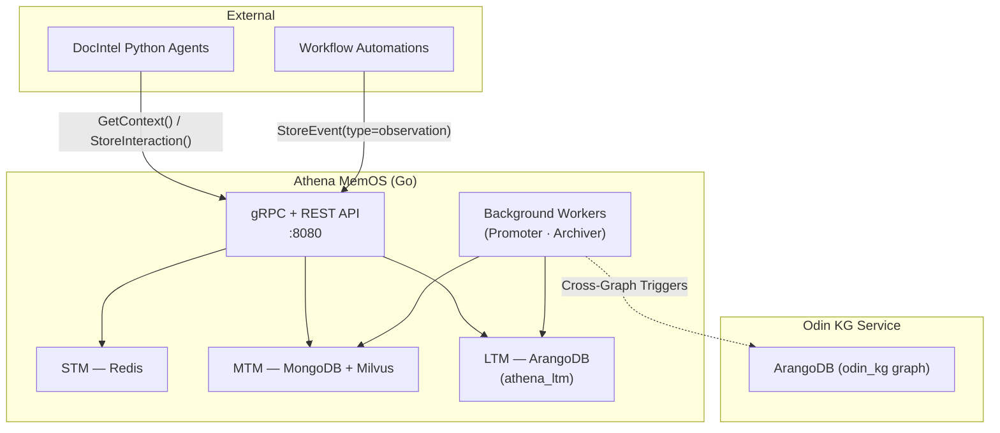

# Athena MemOS — Overview

> **Athena MemOS** is the memory operating system that powers the **Dromos** platform.

This document is the entry point for understanding the role Athena plays within the larger Dromos ecosystem. 

---

## Mission

Athena gives AI agents **persistent memory and structured knowledge** so they can reason across sessions, services, and teams. Where most AI applications forget everything after a conversation ends, Dromos agents backed by Athena retain — and build on — what they have learned over time.

---

## The Three-Tier Memory Architecture

Athena implements memory in three layers, resembling human cognitive structures:

| Tier | Name | Datastore | Purpose |
|---|---|---|---|
| **STM** | **Short-Term Memory** | Redis + MongoDB | Very fast storage of immediate conversational turns. Used for context tracking during an active session. |
| **MTM** | **Mid-Term Memory** | MongoDB + Milvus | Semantic summaries of completed conversation topics ("cognitive chains"). Used to recall prior topics. |
| **LTM / LTPM** | **Long-Term Personal Memory** | ArangoDB | A knowledge graph (`athena_ltm`) of high-heat topics, representing user interests, established facts, and bridging concepts. |

---

## Dromos Ecosystem Integration

Athena is written in **Go 1.24** and acts as the stateful hub for several downstream Python-based services (like `docintel-*` agents, workflow automations, and the `arango-db` Odin KG extraction service).

> **Note on ArangoDB:** The Dromos platform runs two distinct Graph databases. **`athena_ltm`** is managed entirely by Athena for user memory. **`odin_kg`** is an external document intelligence graph managed by a sibling service. Do not write Athena conversational data into the Odin graph.

---

## Glossary of Athena Terms

| Term | Definition |
|---|---|
| **Cognitive chain** | A MTM record representing one coherent conversation topic: includes a summary, topic label, entities, and heat score. |
| **Heat score** | An Ebbinghaus decay value measuring how "warm" a memory is. Chains that are frequently recalled stay hot; unused chains cool and are eventually archived. |
| **Promoter** | A background Go goroutine that runs every 30 minutes, promoting high-heat MTM chains into the persistent LTM graph. |
| **Archiver** | A background Go goroutine that runs every 60 minutes, archiving cold chains (deletes Milvus embeddings, marks MongoDB `archived`). |
| **Memograph** | The LTM knowledge graph. Its vertex collections include `Identities`, `Concepts`, `Tools`, `Projects`, and `Communities`. |
| **Pregel** | ArangoDB's distributed Label Propagation algorithm. Athena relies on external K8s CronJobs to trigger this for community detection, assigning `community_id` tags. |
| **Chain break** | When the background worker detects a conversation topic shift (cosine similarity < 0.52), it triggers MTM formation for the old STM topic. |
| **Claim Check pattern** | Offloading large JSON workflows or binary payloads to Azure Blob storage (`MinIO` locally); Athena only stores the `BlobURI`. |
| **Dual-write** | Every incoming STM event is simultaneously written to Redis (for hot path latency) and MongoDB (for durability). |

---

## Next Steps

Follow the structured reading trail in [`ONBOARDING.md`](./ONBOARDING.md) to continue setting up your environment and understanding the deep-level architecture of Athena.

---

*Last updated: March 2026*
