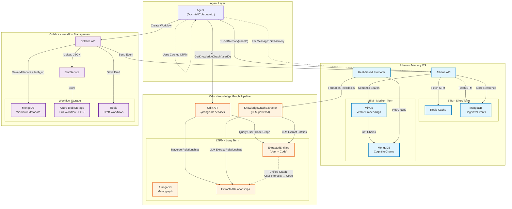

# Athena Unified Architecture
**The Memory Operating System for Dromos Ecosystem**

---

## Executive Summary

Athena is not a traditional memory service; it is the **Memory Operating System** that provides unified intelligence across all Dromos services (DocIntel, Colabra, Workflow Canvas, Automation Logs, etc.). By maintaining a holistic, service-agnostic understanding of users, Athena enables continuity and context awareness across the entire platform.

This document defines the architecture for Athena's evolution into a universal memory layer, its integration patterns with existing services, and the cross-team requirements for successful implementation.

---

## System Architecture Overview



### Key Flows

1. **Session Initialization** (Solid Lines):
   - Agent fetches STM/MTM from Athena
   - Agent fetches LTPM from Odin (cached for session)

2. **Per-Message** (Dotted Lines):
   - Agent only queries Athena for fresh STM/MTM
   - Uses cached LTPM

3. **Workflow Creation** (Purple Path):
   - Colabra stores JSON in Azure Blob
   - Colabra stores metadata in MongoDB
   - Colabra notifies Athena (reference only)

4. **LTPM Promotion** (Orange Path):
   - Athena Promoter sends hot chains to Odin
   - Odin's KG Extractor creates graph nodes
   - Results stored in shared ArangoDB

---

## 1. Core Architecture: The Tri-Store Memory System

Athena uses three specialized data stores, each optimized for a specific memory layer:

### 1.1 Short-Term Memory (STM): MongoDB + Redis

**Purpose**: The "Recorder" - captures every interaction in real-time

**Technology Stack**:
- **MongoDB**: Persistent storage for `CognitiveEvents` (individual messages, actions, observations)
- **Redis**: High-speed cache for active session context

**Data Model**:
```go
type CognitiveEvent struct {
    ID         primitive.ObjectID
    TenantID   string
    UserID     string
    AgentID    string
    ChainID    string
    EventIndex int
    Role       string      // "user", "agent"
    Type       STMEventType // "message", "thought", "action", "observation"
    Content    string
    Status     string      // "in_stm", "archived"
    Metadata   map[string]interface{}
    CreatedAt  time.Time
}
```

**Storage Capabilities**:
- **Chats**: User ↔ Agent conversations
- **Agent Scratch Pads**: Internal reasoning (`Type: "thought"`)
- **Tool Calls**: Action/Observation pairs
- **Automation Logs**: Execution traces (`Type: "observation"`, tagged with workflow_id)

**Retention**: Recent context (last N events or time window)

---

### 1.2 Medium-Term Memory (MTM): MongoDB + Milvus

**Purpose**: The "Associator" - enables semantic search over recent history

**Technology Stack**:
- **MongoDB**: Stores `CognitiveChain` metadata (summarized sessions)
- **Milvus**: Vector embeddings for semantic similarity search

**Data Model**:
```go
type CognitiveChain struct {
    ID          primitive.ObjectID
    TenantID    string
    UserID      string
    AgentID     string
    ChainID     string
    Topic       string
    Summary     string
    Entities    []string  // Extracted entities for basic relationships
    StartedAt   time.Time
    LastEventAt time.Time
    EventCount  int
    Status      string    // "active", "in_mtm", "archived"
    HeatScore   float64
    HeatFactors *HeatFactors
}
```

**Storage Capabilities**:
- **Conversation Sessions**: Grouped by topic/time
- **Workflow Drafts** (metadata only): References to active workflows in Colabra
- **Agent Execution Traces**: Summarized automation runs

**Retention**: Heat-based archival (hot chains promoted to LTPM, cold chains archived)

---

### 1.3 Long-Term Personal Memory (LTPM): ArangoDB (Shared with Odin)

**Purpose**: The "Synthesizer" - distills knowledge into a queryable graph

**Technology**: ArangoDB (multi-model: document + graph)

**Data Model**:
```
Collections:
- ExtractedEntities (Vertices)
  ├── User Interests ("React Development", "Authentication")
  ├── Projects ("Project X", "Mobile App Refactor")
  └── Code Entities (from Odin: "UserService.java", "LoginController")

- ExtractedRelationships (Edges)
  ├── User --[interested_in]--> Topic
  ├── User --[working_on]--> Project
  └── Project --[uses]--> CodeEntity
```

**Storage Capabilities**:
- **User Persona**: Distilled preferences, expertise, communication style
- **Project Context**: Long-term work patterns
- **Cross-Service Knowledge**: Connects conversations to code, workflows to execution results

**Retention**: Permanent (with confidence scoring for decay)

---

## 2. Unified Intelligence Layer

Athena maintains a **holistic understanding of users across all Dromos services** (DocIntel, Colabra, Workflow Canvas, Automation, etc.). This enables context continuity across the platform.

**Example Flow**:
1. User analyzes `AuthService.java` in **DocIntel**
2. Athena stores: `User X → interested_in → Authentication`
3. User opens **Colabra** and asks: "How should I implement 2FA?"
4. Agent queries Athena, receives context about AuthService study
5. **Result**: Intelligent, context-aware response across services

### 2.1 Scoping Model

```
tenant_id → Company/Organization isolation (hard boundary)
user_id   → Individual user context (primary scope)
agent_id  → Optional, tracks which agent created the memory
```

### 2.2 Metadata Tagging

For analytics and filtering, memories can be tagged with origin information:
```json
{
  "metadata": {
    "origin_service": "colabra",
    "context_type": "workflow_design",
    "project_id": "proj_123"
  }
}
```

---

## 3. Athena-Odin Synergy: The Shared Graph Pipeline

### 3.1 The Vision

Instead of building separate graph infrastructure, Athena **plugs into** Odin's existing knowledge extraction pipeline. This creates a **unified knowledge graph** where user context and code context are interconnected.

### 3.2 How Odin Creates Knowledge Graphs Today

**Odin's Pipeline** (`dromos-core/arango-db` service):
1. **Input**: Code files, documentation, PDFs
2. **Decomposition**: Breaks into `TextBlocks`
3. **LLM Extraction**: `KnowledgeGraphExtractor` sends blocks to LLM
4. **LLM Response**: Returns JSON with `nodes` (Entities) and `relationships` (Edges)
5. **Persistence**: Inserts into ArangoDB collections:
   - `ExtractedEntities`
   - `ExtractedRelationships`
   - `EXTRACTED_FROM` (traceability edges)

**Key Component**: `storage/kg_extractor.py`
```python
class KnowledgeGraphExtractor:
    async def extract_from_textblocks(textblocks_data, document_id):
        # LLM extracts entities and relationships
        kg_results = await self.llm_client.batch_extract(batch_inputs)
        
        # Stores in ArangoDB
        for entity in kg_data['nodes']:
            entities_collection.insert({
                'name': entity.name,
                'type': entity.type,
                'created_at': now()
            })
```

### 3.3 How Athena Will Plug Into This Pipeline

**Athena's Integration**:
1. **Synthesize**: Athena's `Promoter` identifies hot `CognitiveChains` (high heat score)
2. **Format**: Converts chain summary into the same format Odin uses (text blocks)
3. **Dispatch**: Sends to `arango-db` service via gRPC/HTTP
4. **Extract**: The **same** `KnowledgeGraphExtractor` extracts entities
5. **Store**: Results stored in the **same** ArangoDB instance

**Example Flow**:
```
CognitiveChain: "User discussed refactoring authentication in Project X"
  ↓ (Promoter detects heat > threshold)
Format as TextBlock:
  {
    "text": "User is interested in authentication refactoring for Project X",
    "metadata": {"origin": "athena", "user_id": "user_123"}
  }
  ↓ (Send to arango-db service)
KnowledgeGraphExtractor processes:
  Nodes: ["User_123", "Authentication", "Project_X"]
  Edges: [User_123 --interested_in--> Authentication,
          User_123 --working_on--> Project_X]
  ↓
Store in ArangoDB (same graph as Odin's code entities)
```

**The Result**: A unified graph where:
- User interests connect to code entities
- Workflow executions link to automation results
- Project context bridges conversations and implementations

### 3.4 Memograph Creation

**"Memograph"** = Memory Graph = The unified LTPM graph in ArangoDB

**Creation Process**:
- **Odin contributes**: Code structure, dependencies, documentation entities
- **Athena contributes**: User preferences, project context, conversation insights
- **Together**: Forms a holistic knowledge base

**Query Example**:
```aql
// Find all code entities related to user's active projects
FOR user IN ExtractedEntities
    FILTER user._key == "user_123"
    FOR v, e, p IN 1..3 OUTBOUND user ExtractedRelationships
        FILTER v.type IN ["Class", "Function", "Project"]
        RETURN DISTINCT v
```

---

## 4. Hybrid Retrieval Model

### 4.1 The Strategy

Agents use a **two-phase retrieval**:
- **Phase 1 (Session Init)**: Fetch comprehensive context
- **Phase 2 (Per Message)**: Fetch incremental updates

### 4.2 Session Initialization

```
Agent starts new session with User X
  ↓
1. Call Athena.GetMemory(userID, initialQuery)
   Returns: {
     STM: [recent 20 events],
     MTM: [top 5 relevant chains]
   }
   ↓
2. Call Odin.GetKnowledgeGraph(userID, scope="active_projects")
   Returns: {
     UserNodes: [interests, facts, preferences],
     CodeNodes: [related classes, functions, projects],
     Workflows: [active workflow references]
   }
   ↓
3. Agent loads LTPM into context window (cached for session)
```

### 4.3 Per-Message Retrieval

```
User sends new message
  ↓
Call Athena.GetMemory(userID, newQuery)
  Returns: {
    STM: [updated recent events],
    MTM: [newly relevant chains based on query]
  }
  ↓
Agent uses cached LTPM (no new call to Odin)
  ↓
Synthesize response from: Fresh STM/MTM + Cached LTPM
```

### 4.4 Rationale

| Decision | Rationale |
|----------|-----------|
| **LTPM cached per session** | Graph traversal is expensive (50-200ms). User's long-term context is stable. |
| **STM/MTM fetched per message** | Recent events change rapidly. Must be fresh. |
| **Two separate calls** | Clean separation: Athena handles memory, Odin handles knowledge. No coupling. |

**Performance Impact**:
- Session init: ~150-300ms (two calls)
- Per message: ~50-100ms (one call)
- Traditional approach (query graph per message): ~200-500ms per message ❌

---

## 5. Workflow Storage: Athena + Colabra Hybrid

### 5.1 The Problem

Workflows are **large, complex JSON documents** (10KB - 1MB). Storing them directly in Athena's MongoDB creates:
- ❌ Bloated memory queries
- ❌ Inefficient vector embeddings
- ❌ Expensive replication

### 5.2 The Hybrid Solution

**Principle**: "Athena stores the map, Colabra stores the treasure"

#### Storage Distribution

| Component | Stored Where | Purpose |
|-----------|--------------|---------|
| **Full Workflow JSON** | Azure Blob Storage | Immutable, versioned storage |
| **Workflow Metadata** | Colabra MongoDB | Title, tags, author, version, `blob_url` |
| **Active Drafts** | Colabra Redis | Real-time collaborative editing |
| **Workflow Reference** | Athena MTM | `CognitiveChain` with `metadata.workflow_id`, `metadata.blob_url` |
| **Workflow Context** | Athena LTPM | User --[created]--> Workflow (as ArangoDB entity) |

### 5.3 Detailed Flow

#### A. Workflow Creation (Colabra)
```
1. User designs workflow in Colabra Canvas
   ↓
2. Colabra saves draft to Redis (key: workflow_draft:{sessionId})
   ↓
3. User clicks "Save"
   ↓
4. Colabra:
   a. Uploads JSON to Azure Blob Storage
      → Returns: blob_url = "https://blob.../workflows/wf_123_v1.json"
   b. Saves metadata to MongoDB:
      {
        workflow_id: "wf_123",
        title: "Claims Processing Flow",
        version: 1,
        blob_url: "https://blob.../workflows/wf_123_v1.json",
        created_by: "user_123",
        tags: ["claims", "automation"]
      }
   c. Sends event to Athena:
      POST /memory/events
      {
        type: "observation",
        content: "User created workflow: Claims Processing Flow",
        metadata: {
          workflow_id: "wf_123",
          blob_url: "https://blob.../workflows/wf_123_v1.json"
        }
      }
   ↓
5. Athena:
   a. Stores CognitiveEvent in STM
   b. Updates CognitiveChain with workflow reference
   c. (Later) Promoter creates LTPM entity: User --[created]--> Workflow_Claims
```

#### B. Workflow Retrieval (Agent)
```
1. User asks: "Show me my claims workflows"
   ↓
2. Agent calls Athena.GetMemory(userID, "claims workflows")
   Returns: {
     MTM: [
       {
         chainId: "chain_abc",
         summary: "Created Claims Processing Flow",
         metadata: {
           workflow_id: "wf_123",
           blob_url: "https://blob.../workflows/wf_123_v1.json"
         }
       }
     ]
   }
   ↓
3. Agent extracts blob_url, fetches full JSON from Azure Blob
   ↓
4. Agent displays workflow to user
```

**Why This Works**:
- ✅ Athena knows workflows exist (via metadata)
- ✅ Athena can find relevant workflows (via semantic search)
- ✅ Full workflow data remains in specialized storage
- ✅ No duplication between Athena and Colabra

---

## 6. Changes in Colabra-API

### 6.1 Current State (Before)

**Workflow Storage**:
- MongoDB: Full workflow JSON + metadata
- Redis: Ephemeral drafts

**Problems**:
- Large documents in MongoDB slow down queries
- No versioning or immutability
- No integration with Athena

### 6.2 New Architecture (After)

#### MongoDB Role Evolution

**Before**: Primary storage for full workflows
```js
// Old schema
{
  _id: ObjectId("..."),
  title: "Claims Flow",
  steps: [...],        // ← Large array
  nodes: [...],        // ← Large array
  edges: [...],        // ← Large array
  created_at: ISODate(...)
}
```

**After**: Lightweight metadata index
```js
// New schema
{
  _id: ObjectId("..."),
  workflow_id: "wf_123",
  title: "Claims Flow",
  version: 1,
  blob_url: "https://dromos.blob.core.windows.net/workflows/wf_123_v1.json",
  blob_container: "workflows",
  blob_key: "wf_123_v1.json",
  created_by: "user_123",
  created_at: ISODate(...),
  tags: ["claims", "automation"],
  session_id: ObjectId("...")
}
```

**Query Patterns**:
- List workflows by user: `db.workflows.find({created_by: "user_123"})`
- Search by tag: `db.workflows.find({tags: "claims"})`
- Get metadata: Fast (no large fields)
- Get full workflow: Use `blob_url` to fetch from Azure

#### Azure Blob Storage Introduction

**Purpose**: Immutable, versioned storage for large workflow JSON

**Storage Structure**:
```
Container: workflows
├── wf_123_v1.json          (Version 1)
├── wf_123_v2.json          (Version 2)
├── wf_456_v1.json
└── wf_789_v1.json

Metadata (per blob):
- Content-Type: application/json
- x-ms-meta-workflow-id: wf_123
- x-ms-meta-version: 1
- x-ms-meta-created-by: user_123
```

**Operations**:
- **Upload**: `BlobClient.upload_blob(workflow_json, overwrite=False)`
- **Download**: `BlobClient.download_blob().readall()`
- **List Versions**: `ContainerClient.list_blobs(name_starts_with="wf_123")`

**Benefits**:
- ✅ Cheap storage ($0.01/GB vs MongoDB's compute costs)
- ✅ Built-in versioning (append-only, no overwrites)
- ✅ Global CDN access (if needed for distributed agents)
- ✅ Immutability (compliance, audit trails)

#### Redis Role (Unchanged)

**Purpose**: Real-time collaborative drafts

**Usage**:
- Key: `workflow_draft:{sessionId}`
- TTL: 24 hours
- Value: Current draft JSON (updated on every Canvas change)

---

## 7. Automation Logs Storage

### 7.1 Current State (Colabra)

**Problem**: Automation logs are **ephemeral** (streamed via SSE/WebSocket, not persisted)

**Impact**:
- Users can't review past executions
- No debugging of historical failures
- Athena has no record of automation activity

### 7.2 New Architecture

**Storage Strategy**:
```
Real-time Stream (Existing):
  Colabra → SSE/WebSocket → Frontend

Persistent Storage (New):
  Colabra → Athena → STM (CognitiveEvents)
```

**Data Model in Athena**:
```go
type CognitiveEvent struct {
    Type: "observation"
    Content: "Step 3: API call to user service completed"
    Metadata: {
        "workflow_id": "wf_123",
        "execution_id": "exec_456",
        "step_id": "step_3",
        "status": "success",
        "duration_ms": 1200
    }
}
```

**Implementation in Colabra**:
```go
// In WorkflowExecutionService.UpdateStepProgress()
func (s *WorkflowExecutionService) UpdateStepProgress(...) error {
    // Existing: Update MongoDB
    _, err := collection.UpdateOne(...)
    
    // NEW: Send to Athena
    athenaClient.StoreEvent(CognitiveEvent{
        Type: "observation",
        Content: fmt.Sprintf("Step %s: %s", stepID, status),
        Metadata: map[string]interface{}{
            "workflow_id": workflowID,
            "execution_id": executionID,
            "step_id": stepID,
            "status": status,
        },
    })
    
    return err
}
```

**Benefits**:
- ✅ Full audit trail in Athena
- ✅ Searchable execution history ("When did workflow X last fail?")
- ✅ Cross-service intelligence (link workflow failures to code changes)

---

## 8. Cross-Team Requirements

### 8.1 Odin Team Requirements

**Context**: Athena needs to plug into Odin's graph extraction pipeline

#### Required Changes

1. **Expose KnowledgeGraphExtractor as a Service**

   **Current State**: `kg_extractor.py` is embedded in `arango-db` service, only callable internally
   
   **Required**: Add HTTP/gRPC endpoint
   
   ```python
   # New endpoint in arango-db/main.py
   @app.post("/api/v1/extract-knowledge")
   async def extract_knowledge(request: KGExtractionRequest):
       """
       Extract entities/relationships from text blocks
       Used by: Athena (for user conversations), Odin (for code/docs)
       """
       extractor = KnowledgeGraphExtractor(schema_manager, llm_url)
       results = await extractor.extract_from_textblocks(
           textblocks_data=request.textblocks,
           document_id=request.document_id
       )
       return {"entities": results['entities_created'], ...}
   ```
   
   **Request Format**:
   ```json
   {
     "document_id": "athena_chain_abc123",
     "textblocks": [
       {
         "chunkId": "block_1",
         "text": "User is interested in authentication refactoring for Project X",
         "metadata": {"origin": "athena", "user_id": "user_123"}
       }
     ]
   }
   ```

2. **Support Custom Entity Types**

   **Current**: `ExtractedEntities` assumes code-specific types (Class, Function, etc.)
   
   **Required**: Allow Athena to create user-specific types
   
   ```python
   # Extend VertexTypes collection
   {
     "name": "UserInterest",
     "collection": "ExtractedEntities",
     "keyField": ["name"],
     "textFields": ["name"],
     "description": "User interests extracted from conversations"
   }
   ```

3. **Add origin_source Metadata**

   **Required**: Tag entities with source (odin vs athena)
   
   ```python
   # Modified in kg_extractor.py
   entity_data = {
       '_key': entity_key,
       'name': entity_name,
       'type': entity_type,
       'origin_source': request.metadata.get('origin', 'odin'),  # NEW
       'created_at': datetime.utcnow().isoformat()
   }
   ```

#### Deployment/Configuration

**Environment Variables**:
```bash
# arango-db service
ENABLE_ATHENA_INTEGRATION=true
ATHENA_ENTITY_TYPES=UserInterest,UserProject,UserPreference
```

**Estimated Effort**: 2-3 days
- 1 day: Endpoint implementation
- 0.5 day: Entity type extension
- 0.5 day: Testing
- 1 day: Deployment + monitoring

---

### 8.2 Colabra-API Team Requirements

**Context**: Colabra needs to split workflow storage (Blob + Metadata) and integrate with Athena

#### Required Changes

0. **Remove ChatService (CRITICAL)**

   **Current State**: Colabra has its own `ChatService` that manages conversation history
   
   **Required**: Delete `ChatService` entirely - Athena now owns all memory
   
   **Rationale**:
   - Athena is the single source of truth for all user interactions
   - Duplicate chat storage creates inconsistency
   - Colabra becomes a "stateless frontend BFF" for workflow visualization
   
   **Files to Delete/Modify**:
   ```
   DELETE: internal/services/chat_service.go
   MODIFY: Any controllers calling ChatService → Replace with AthenaClient.GetMemory()
   ```
   
   **Example Replacement**:
   ```go
   // BEFORE
   messages, err := chatService.GetConversationHistory(userID, sessionID)
   
   // AFTER
   context, err := athenaClient.GetMemory(userID, sessionID)
   messages := context.STM // Recent events
   ```

1. **Implement BlobService**

   **New Component**: `internal/services/blob_service.go`
   
   ```go
   type BlobService struct {
       client *azblob.Client
       containerName string
   }
   
   func (s *BlobService) UploadWorkflow(workflowID string, version int, data []byte) (string, error) {
       blobName := fmt.Sprintf("%s_v%d.json", workflowID, version)
       blobClient := s.client.ServiceClient().
           NewContainerClient(s.containerName).
           NewBlockBlobClient(blobName)
       
       _, err := blobClient.Upload(ctx, bytes.NewReader(data), nil)
       if err != nil {
           return "", err
       }
       
       return blobClient.URL(), nil
   }
   
   func (s *BlobService) DownloadWorkflow(blobURL string) ([]byte, error) {
       // Implementation
   }
   ```

2. **Refactor WorkflowService**

   **Current**: `WorkflowService.CreateAIWorkflow()` saves full JSON to MongoDB
   
   **Required**: Split into Blob upload + Metadata save
   
   ```go
   func (s *WorkflowService) CreateAIWorkflow(workflow *models.Workflow) error {
       // 1. Generate workflow JSON
       workflowJSON, _ := json.Marshal(workflow)
       
       // 2. Upload to Blob Storage (NEW)
       blobURL, err := s.blobService.UploadWorkflow(
           workflow.ID.Hex(),
           1, // version
           workflowJSON,
       )
       
       // 3. Save lightweight metadata to MongoDB (MODIFIED)
       metadata := models.WorkflowMetadata{
           WorkflowID: workflow.ID.Hex(),
           Title: workflow.Title,
           Version: 1,
           BlobURL: blobURL,
           CreatedBy: workflow.CreatedBy,
           Tags: extractTags(workflow),
       }
       collection.InsertOne(ctx, metadata)
       
       // 4. Send event to Athena (NEW)
       athenaClient.StoreEvent(CognitiveEvent{
           Type: "observation",
           Content: fmt.Sprintf("Created workflow: %s", workflow.Title),
           Metadata: map[string]interface{}{
               "workflow_id": workflow.ID.Hex(),
               "blob_url": blobURL,
           },
       })
       
       return nil
   }
   ```

3. **Integrate AthenaClient**

   **New Component**: `internal/clients/athena_client.go`
   
   ```go
   type AthenaClient struct {
       baseURL string
       httpClient *http.Client
   }
   
   func (c *AthenaClient) StoreEvent(event CognitiveEvent) error {
       // POST /memory/events
   }
   ```

4. **Persist Automation Logs**

   **Modify**: `WorkflowExecutionService.UpdateStepProgress()`
   
   Add Athena integration (as shown in section 7.2)

#### Database Migration

**Migration Script**: `migrations/003_workflow_blob_split.go`
```go
// Migrate existing workflows to Blob Storage
func MigrateWorkflowsToBlob(db *mongo.Database, blobService *BlobService) error {
    workflows, _ := db.Collection("workflows").Find(...)
    
    for _, workflow := range workflows {
        // Upload to blob
        workflowJSON, _ := json.Marshal(workflow)
        blobURL, _ := blobService.UploadWorkflow(workflow.ID, 1, workflowJSON)
        
        // Update MongoDB with metadata only
        db.Collection("workflows").UpdateOne(
            bson.M{"_id": workflow.ID},
            bson.M{"$set": bson.M{
                "blob_url": blobURL,
                "$unset": bson.M{"steps": "", "nodes": "", "edges": ""},
            }},
        )
    }
}
```

#### Configuration

**Environment Variables**:
```bash
# Colabra-API
AZURE_STORAGE_CONNECTION_STRING=...
AZURE_BLOB_CONTAINER_NAME=workflows
ATHENA_BASE_URL=http://memory-os:8080
```

**Estimated Effort**: 3-4 days
- 1 day: BlobService implementation
- 1 day: WorkflowService refactor
- 1 day: AthenaClient integration
- 0.5 day: Migration script
- 0.5 day: Testing + deployment

---

## 9. Review & Additions

### What We've Covered

✅ **Tri-Store Architecture** (STM, MTM, LTPM)  
✅ **Service-Agnostic Design** (no service_id scoping)  
✅ **Athena-Odin Synergy** (shared graph pipeline)  
✅ **Workflow Hybrid Storage** (Blob + Metadata)  
✅ **Automation Logs** (persistent in Athena)  
✅ **Hybrid Retrieval** (per-session LTPM, per-message STM/MTM)  
✅ **Cross-Team Requirements** (Odin, Colabra-API)  

### Additional Considerations

#### 10.1 Observability

**Metrics to Track**:
- Athena query latency (P50, P95, P99)
- LTPM cache hit rate (sessions reusing cached knowledge)
- Blob Storage retrieval time
- Promoter throughput (chains promoted per hour)

**Logging**:
- All Athena ↔ Odin calls (for debugging graph creation)
- Workflow storage events (Blob uploads, metadata writes)

#### 10.2 Security & Access Control

**Tenant Isolation**:
- All queries scoped by `tenant_id`
- ArangoDB graph partitioning per tenant (via collections or graph names)

**Blob Security**:
- Shared Access Signatures (SAS) for time-limited blob access
- No public read access (agent-mediated retrieval only)

#### 10.3 Scalability Considerations

**Athena STM/MTM**:
- MongoDB sharding by `user_id` (when user base > 100K)
- Milvus partitioning by tenant (when embeddings > 10M)

**ArangoDB LTPM**:
- Graph partitioning (separate graphs per tenant)
- Read replicas for query scaling

**Blob Storage**:
- Azure CDN for global access (if agents distributed globally)
- Lifecycle policies (archive old versions after 1 year)

#### 10.4 Failure Modes & Recovery

**Scenario 1: Blob Upload Fails**
- Fallback: Store workflow in MongoDB temporarily
- Retry: Background job attempts Blob upload
- Alert: If retries fail after 24h

**Scenario 2: Odin KG Extraction Fails**
- Fallback: Athena stores raw chain in MTM (no LTPM promotion)
- Retry: Manual promotion trigger after Odin service recovery

**Scenario 3: ArangoDB Unavailable**
- Impact: No LTPM retrieval (agents use STM/MTM only)
- Degraded mode: Agents still functional, but without long-term context

---

## 11. Conclusion

This architecture transforms Athena from a simple memory service into a **Memory Operating System** that:

1. **Unifies Intelligence**: No silos, no service_id barriers
2. **Minimizes Duplication**: One graph pipeline (Odin + Athena)
3. **Optimizes Performance**: Smart caching (hybrid retrieval)
4. **Scales Efficiently**: Right storage for right data (Mongo + Milvus + Arango + Blob)

**Next Steps**: Team leads review, provide feedback, then proceed to Phase 1 implementation.
