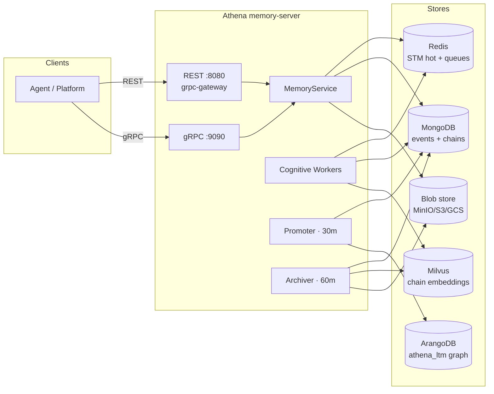

# Architecture

Athena is a **Memory Operating System**: a single service that gives every agent in a fleet persistent, multi-tier memory. Agents talk to one API; behind it, a background pipeline continuously distills raw conversation into summarized topics and, eventually, into a knowledge graph.

## The system at a glance

One binary, `cmd/memory-server`, hosts everything: the API, the worker pool, and the schedulers. There is no separate worker deployment.

## One API, two protocols

The API is defined once in `api/grpc/memory.proto`. gRPC serves it natively on **:9090**; [grpc-gateway](https://github.com/grpc-ecosystem/grpc-gateway) translates the same RPCs to REST on **:8080** using the `google.api.http` annotations. Every RPC therefore has a canonical REST mapping (documented per-endpoint in the [API Reference](../reference/api.md)).

Port 8080 additionally serves three non-RPC routes: `/health` (liveness, no auth), `/metrics` (Prometheus, no auth), and the gateway-mounted `/api/v1/*` routes.

??? question "Why this design?"
    Athena serves two very different audiences. Its primary consumers are platform Go services: latency-sensitive, high-frequency calls where gRPC's binary framing, HTTP/2 multiplexing, and generated typed clients pay off. But memory is also something scripts, benchmark harnesses, CronJobs, and `curl` need to reach, and those get plain JSON over REST with zero extra tooling.

    Generating both surfaces from one proto eliminates contract drift: field renames, new endpoints, and deprecations propagate to gRPC, REST, and the OpenAPI spec mechanically via `make generate`. Auth middleware wraps the service once, so tenant isolation is never implemented twice. The accepted trade-offs: a codegen step in CI (generated `*.pb.go` / `*.pb.gw.go` files are never committed), grpc-gateway's URL-mapping constraints, and gRPC→HTTP error translation being fixed by convention (`InvalidArgument`→400, `NotFound`→404, `FailedPrecondition`→412, `Internal`→500).

## Write path

When an agent calls `StoreInteraction` or `StoreEvent`:

1. **Dual-write.** The event lands in the Redis STM window (`stm:{tenant}:{user}:{agent}`, newest-first) *and* in MongoDB `cognitive_events` for durability. Redis makes reads instant; MongoDB survives restarts.
2. **Blob offload.** Binary payloads are uploaded to blob storage and replaced with a URI.
3. **Task enqueue.** For user messages, a `cognitive_chain_check` task is pushed to a per-user Redis queue, and that queue's name is pushed to the global dispatcher queue: a two-level design that keeps one noisy user from starving others ([details](cognitive-pipeline.md)).

The write returns as soon as step 1–3 complete. Everything cognitive happens asynchronously.

## Background pipeline

Three independent loops move memory between tiers:

| Loop | Trigger | Job |
|---|---|---|
| **Workers** (×2) | Task queue (`BRPop`) | Detect topic breaks, form cognitive chains ([Chain Formation](chain-formation.md)) |
| **Promoter** | 30-minute ticker | Score chain heat; promote hot chains to the LTM graph ([Heat & Decay](heat-and-decay.md), [Promotion](promotion-and-knowledge-graph.md)) |
| **Archiver** | 60-minute ticker | Freeze cold chains; delete their vectors and blobs ([Archival](archival-and-lifecycle.md)) |

??? question "Why these cadences?"
    Each ticker only needs to sample faster than its signal changes. The promoter's input is heat, which decays with $\tau = 24h$: in 30 minutes heat moves by roughly 2%, so a 30-minute sweep can never miss a promotion window. It's also the *expensive* loop (every pass re-scores all active chains; every promotion is an LLM call plus graph writes), so its interval is effectively an LLM budget knob. Nothing user-facing waits on it either, since new chains are already searchable in MTM seconds after formation. The archiver's decision inputs are "idle > 7 days" and a heat floor: against a 7-day window, hourly is massively oversampled, and the work is pure janitorial cleanup with no LLM cost. The 2:1 ratio encodes *promotion is time-sensitive-ish and costly; archival is neither.*

    Both are env-tunable (`MEMORY_OS_PROMOTER_INTERVAL_MIN`, `MEMORY_OS_ARCHIVER_INTERVAL_MIN`); local development sets both to **1 minute** (`run_local_server.sh`) so you can watch the pipeline work without waiting.

A fourth process, [Graph Analytics](graph-analytics.md), runs **outside** the server as a daily Kubernetes CronJob calling `POST /api/v1/admin/analytics/trigger`. It must never run in-process: Pregel loads the whole graph into memory.

## Read path

Reads answer from the tiers directly, without touching the pipeline:

- **`GetContext`** returns the STM window from Redis (plus MTM pages: semantic if a `query` is given, otherwise recency-ranked).
- **`SearchMemory`** embeds the query, searches Milvus for matching chains across *all* the user's agents, and enriches results from the LTM graph.

## The stores and what owns them

| Store | Owns | Written by | Read by |
|---|---|---|---|
| Redis | STM window, task queues, task results | API, workers | API, workers |
| MongoDB | `cognitive_events` (raw log), `cognitive_chains` (MTM), sessions | API, workers, promoter, archiver | everything |
| Milvus | one embedding per chain | workers | `SearchMemory`, `GetContext(query)` |
| ArangoDB | `athena_ltm`: 5 vertex collections + `MemoryEdges` | promoter, analytics | `SearchMemory` enrichment |
| Blob store | oversized event payloads | API | consumers via URI |

!!! note "Athena owns exactly one ArangoDB database"
    Everything Athena writes lives in `athena_ltm`. It never creates or touches other databases on the instance, so co-hosting other applications' databases on the same ArangoDB deployment is safe.

## Multi-tenancy

Every key, document, and vector is scoped by the `tenant → user → agent` hierarchy; identity comes from the auth layer, not from request bodies. [Sessions & Identity](sessions-and-identity.md) covers the model; the [Security Model](security-model.md) covers enforcement.

## Deployment shape

A single stateless container (multi-stage Alpine build, non-root UID 1000, health-checked on `/health`). State lives entirely in the five stores, so you scale by running replicas; the two-level task queue and Redis-based coordination keep workers from colliding. Run it anywhere containers run: Docker Compose for local development, Kubernetes or a managed container platform in production. See [Deploying Athena](../guides/deploying-athena.md).
