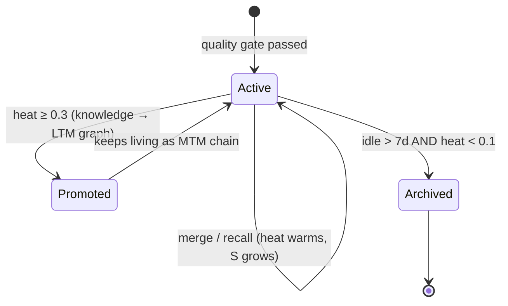

# Archival & Lifecycle

Memory that is never used must eventually stop costing money. The archiver is the pipeline's garbage collector: a 60-minute ticker that freezes chains whose [heat](heat-and-decay.md) has collapsed.

## The full chain lifecycle



Promotion and archival are independent: a chain can be promoted early in life and archived later, and the knowledge it contributed to the graph **persists after the chain freezes**. That's the entire point of the tier system: form decays, meaning survives.

## Selection: who gets frozen

Every pass, the archiver queries MongoDB for candidates:

```
status == "active"
AND ( last_accessed_at < now − MTM_ARCHIVE_SCAN_DAYS
      OR (never accessed AND last_event_at < now − MTM_ARCHIVE_SCAN_DAYS) )
```

with `MTM_ARCHIVE_SCAN_DAYS` defaulting to **7**. For each candidate the current heat is computed; only chains below the **freezing point** (`MTM_FREEZING_POINT`, default **0.1**) are archived. A seven-day-idle chain that a user recently searched (recall warmed it) survives the sweep.

## What archiving does

Per chain, in order:

1. **Delete the Milvus vector.** The chain immediately disappears from semantic search.
2. **Mark the MongoDB document** with `status: "archived"`, `archivedAt`, and the final `heatScore`. The document itself is *not* deleted; the summary and metadata remain for audit and potential future re-hydration.
3. **Garbage-collect blobs.** Every `cognitive_event` in the chain holding a `blobUri` has its object deleted from blob storage.

Failures degrade gracefully: if Milvus or the blob store is down, the error is logged and archiving continues. Mongo status remains the source of truth, and orphaned vectors/blobs are cleaned on later passes.

## What archived means for the API

- `SearchMemory` cannot return archived chains (no vector).
- `GetContext` recency blending queries active chains only.
- The raw `cognitive_events` documents remain in MongoDB (subject to your own retention policy on that collection).
- Knowledge already promoted to `athena_ltm` is untouched; graph edges have their own lifecycle (weight/confidence, no deletion).

## Tuning

| Knob | Default | Effect of raising it |
|---|---|---|
| `MTM_ARCHIVE_SCAN_DAYS` | 7 | Chains stay searchable longer while idle |
| `MTM_FREEZING_POINT` | 0.1 | More aggressive freezing (more chains fall below the bar) |
| `HEAT_DECAY_TAU_HOURS` | 24 | Slower decay everywhere; fewer chains ever reach the freezing point |

Watch storage growth against `memos_promoter_chains_evaluated_total` and archive counts in the [metrics](../reference/metrics.md) before adjusting.
