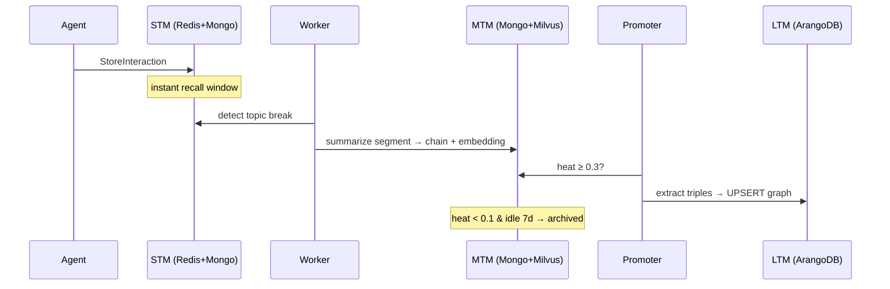

# Memory Tiers

Athena models memory the way cognitive science does: a small, fast working memory; a consolidating mid-term store; and a durable long-term store of distilled knowledge. Each tier has its own datastore, granularity, and lifetime.

| | STM | MTM | LTM |
|---|---|---|---|
| **Holds** | Raw events | Cognitive chains (summarized topics) | Knowledge graph (entities + relations) |
| **Granularity** | One message/thought/action | One topic segment | One fact |
| **Stores** | Redis + MongoDB | MongoDB + Milvus | ArangoDB |
| **Lifetime** | 2h window / durable log | Until archived (heat-based) | Permanent |
| **Written by** | API (synchronous) | Workers (async) | Promoter (async) |

## STM: Short-Term Memory

The verbatim record of what is happening *right now*.

**Hot path (Redis).** Every event is `LPUSH`ed to a per-scope list under the key `stm:{tenantId}:{userId}:{agentId}`, trimmed to a sliding window of `STM_CACHE_MAX_TURNS` (default **10**) and expiring after `STM_CACHE_TTL` (default **2 hours**) of inactivity. `GetContext` reads this list; it's a single `LRANGE`.

**Durable path (MongoDB).** The same event is simultaneously inserted into `cognitive_events`. Redis can evaporate; MongoDB is the system of record and the source the worker partitions into chains.

**Event coalescing.** Automation floods are absorbed at the door: consecutive `observation` events carrying the same `execution_id` and `step_id` are merged into one event (content replaced, metadata merged, `coalesced_count` incremented) instead of consuming window slots. A CI pipeline emitting 40 log lines occupies one STM slot, not 40.

**Event anatomy**: four types × three roles:

```
role: user | agent | system
type: message | thought | action | observation
```

plus optional `metadata` (e.g. `workflow_id`, `execution_id`, `origin_service`) and an optional blob payload (uploaded to object storage, referenced by URI). See [Storing Memory](../guides/storing-memory.md).

## MTM: Mid-Term Memory

When the conversation moves on, the worker cuts the finished topic segment out of STM and distills it into a **cognitive chain**, a MongoDB document in `cognitive_chains`:

- an LLM-written **summary**, **topic**, and extracted **entities**
- a quality score from the [validation gate](chain-formation.md#the-quality-gate)
- a **heat score** and recall metadata driving its lifecycle ([Heat & Decay](heat-and-decay.md))
- one **embedding** stored in Milvus, making the chain semantically searchable

Chains are living documents: a returning conversation on the same topic can [merge into an existing chain](chain-formation.md#merging) rather than spawn a duplicate, and every retrieval warms the chain's heat.

MTM is what `SearchMemory` searches and what `GetContext` blends in as `relevant_pages`: memory that has left the window but is still fresh enough to matter.

## LTM: Long-Term Memory

Chains that stay hot cross the promotion threshold and get **read for knowledge**: an LLM extracts subject–relation–object triples from the chain summary, which are UPSERTed into the `athena_ltm` graph in ArangoDB:

- **Vertex collections:** `Identities`, `Concepts`, `Tools`, `Projects` (+ `Communities` from analytics)
- **Edge collection:** `MemoryEdges`, with a whitelisted relation vocabulary (`USES`, `WORKS_ON`, `BUILT_FOR_CLIENT`, `STRUGGLES_WITH`, `EXHIBITS`, `EXPRESSED_INTEREST`, `RELATES_TO`), per-edge confidence, and a frequency `weight` that increments every time the same fact is re-observed

LTM is deduplicated by construction: observing "John uses Go" ten times produces one edge with `weight: 10`, not ten edges. Retrieval traverses 1–2 hops from matched entities, filtered to `confidence >= 0.5`. Full mechanics in [Promotion & the Knowledge Graph](promotion-and-knowledge-graph.md).

## How a memory moves through the tiers



The tiers are progressively **lossy in form but durable in meaning**: STM keeps every word for hours, MTM keeps the gist for as long as it stays warm, LTM keeps the facts forever.
