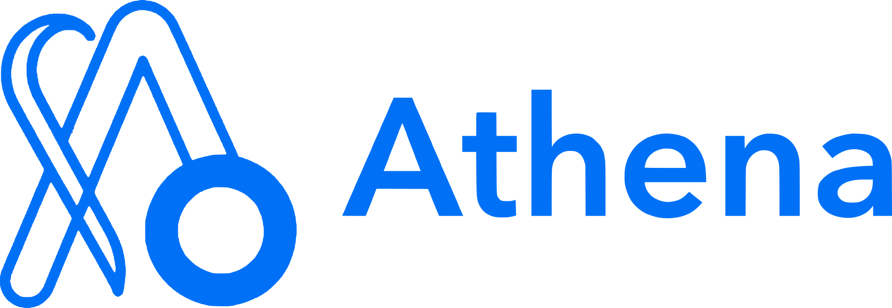

<div class="nx-hero" markdown>



# The Memory Operating System for AI agents

Perfect cross-session memory for every agent in your fleet. Athena captures every interaction, distills it into cognitive chains, and promotes what matters into a persistent knowledge graph. Your agents remember users, projects, and context across sessions, forever.

<div class="nx-cta" markdown>

[Get started](getting-started/quickstart.md){ .nx-btn .nx-btn-primary }
[View on GitHub](https://github.com/Prescott-Data/athena){ .nx-btn .nx-btn-github target="_blank" rel="noopener" }

</div>

</div>

---

## What Athena does

Every agent conversation evaporates when the session ends. Context windows overflow, users repeat themselves, and hard-won knowledge about a user's projects, tools, and struggles is lost. Athena eliminates that loss entirely.

Store every interaction through one API. Athena writes it to a short-term window your agent can read back instantly, then works in the background: a cognitive worker detects when the topic shifts, distills each topic into a summarized *cognitive chain* with its own embedding, and scores every chain with an Ebbinghaus-style heat model where memories that are recalled stay warm and memories that are ignored decay. Chains that stay hot are promoted into a long-term knowledge graph of identities, concepts, tools, and projects, connected by typed, confidence-weighted relationships. Ask Athena a question and it answers from all three tiers at once.

Athena is multi-tenant from the first byte. Every event is scoped to a `tenant → user → agent` hierarchy enforced at the auth layer, so one deployment serves your whole platform with hard data isolation.

<div class="nx-grid" markdown>

<div class="nx-card" markdown>
<span class="nx-card-label">STM</span>

**The hot window.** A Redis-backed sliding window of recent events, dual-written to MongoDB for durability. Instant recall of the current conversation.
</div>

<div class="nx-card" markdown>
<span class="nx-card-label">MTM</span>

**Cognitive chains.** Topic-segmented summaries with embeddings in Milvus. Semantically searchable, heat-scored, merged and validated by a quality gate.
</div>

<div class="nx-card" markdown>
<span class="nx-card-label">LTM</span>

**The knowledge graph.** An ArangoDB graph of identities, concepts, tools, and projects. Typed relations, confidence weighting, community detection.
</div>

<div class="nx-card" markdown>
<span class="nx-card-label">API & SDK</span>

**One surface, two protocols.** gRPC and REST from a single proto definition, plus a Go client SDK. API-key, JWT, and mTLS auth built in.
</div>

</div>

---

## Quick start

```bash
docker compose -f docker-compose.local.yml up -d
go run cmd/init-ltm/main.go
go run cmd/memory-server/main.go
```

REST listens on `localhost:8080`. gRPC listens on `localhost:9090`.

---

## Where to start

Start with [Architecture](concepts/architecture.md) under the Concepts tab. It establishes the three-tier memory model, the background pipeline that moves memories between tiers, and the multi-tenant identity hierarchy. Every other page assumes that mental model.
